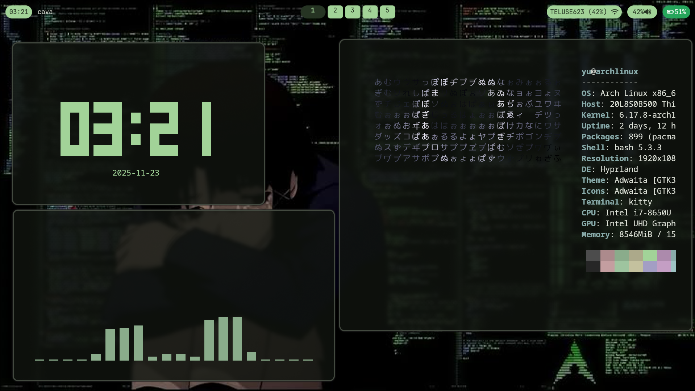

# Arch Linux Hyprland Dotfiles

My personal dotfiles for Arch Linux with Hyprland window manager.

## Showcase



## System Information

- **OS:** Arch Linux
- **WM:** Hyprland
- **Display Manager:** SDDM
- **Shell:** zsh
- **Terminal:** kitty
- **Bar:** Waybar
- **Launcher:** Rofi
- **Theme Generator:** Matugen
- **System Info:** Fastfetch

## Structure

```
.
├── .config/
│   ├── fastfetch/       # System information tool
│   ├── hypr/            # Hyprland window manager
│   ├── kitty/           # Kitty terminal emulator
│   ├── matugen/         # Material Design color scheme generator
│   ├── rofi/            # Application launcher
│   └── waybar/          # Status bar
├── .local/bin/
│   └── walset           # Wallpaper setter script
├── sddm/                # SDDM display manager
└── .zshrc              # zsh shell configuration
```

##  Installation

### Prerequisites

Make sure you have the following packages installed:

```bash
sudo pacman -S hyprland sddm kitty waybar rofi fastfetch git stow zsh

# Install matugen from AUR
yay -S matugen-bin
```
Also need to install Nerd font

### Clone the Repository

```bash
git clone git@github.com:SungYu444/Arch-dotfiles.git ~/.dotfiles
cd ~/.dotfiles
```

### Deploy User Configurations

Using GNU Stow:

```bash
# Deploy all configs at once
stow .

# The .stow-local-ignore file will handle excluding git files
```

### Deploy System Configurations

For system-level configs (like SDDM):

manually:

```bash
sudo cp sddm/sddm.conf /etc/sddm.conf
```

## Configuration

### Matugen Theme System

This setup uses Matugen to generate coordinated color schemes across all applications:

- Generate colors from wallpaper: `walset <image>`
- Templates are in `.config/matugen/templates/`
- Auto-generates matching colors for Hyprland, Kitty, Rofi, and Waybar

### Hyprland

The Hyprland configuration includes:
- Custom keybindings
- Window rules
- Monitor setup
- Startup applications
- Color scheme from Matugen

Edit `~/.config/hypr/hyprland.conf` to customize.

### SDDM

The SDDM configuration includes a weather theme. After making changes:

```bash
sudo systemctl restart sddm
```

## Notes

- User configurations (`.config/`, `.zshrc`, `.local/bin/`) are managed with GNU Stow
- System configurations (`sddm/`) require sudo and are deployed via install script
- The setup uses Matugen for automatic theme generation from wallpapers
- `.stow-local-ignore` prevents stowing git files
- Make sure to backup your existing configs before deploying

## 🔄 Updating

To update configurations:

```bash
cd ~/.dotfiles
git pull
stow --restow .  # Restow to update symlinks
```
